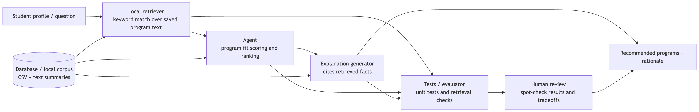
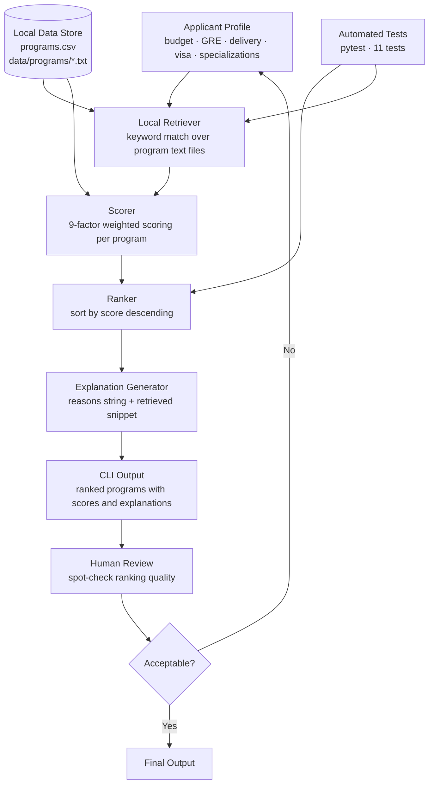

# CS Master's Program Recommender

## Original Project: Modules 1–3

The original project was a **Music Recommender Simulation**. It used a content-based scoring system to rank songs from a small local CSV dataset by comparing user taste preferences (genre, mood, energy, tempo, valence, danceability, acousticness) to each song's attributes. The goal was to make recommendation logic transparent, testable, and easy to inspect without any external APIs.

---

## Final Project: CS Master's Program Recommender

This system recommends Computer Science master's programs based on applicant priorities: budget, GRE willingness, delivery mode (online vs. in-person), visa support needs, ranking preference, target specializations, and time to graduation.

The system matters because applicants face hard, competing tradeoffs and benefit from structured, explainable support. Unlike a neural model, every score is fully auditable — each factor's contribution is printed with the recommendation.

**Key capabilities:**

- Loads 10 curated CS programs from a local CSV plus per-program text files
- Scores and ranks programs using a 9-factor weighted algorithm
- Retrieves relevant sentences from local program notes to ground each explanation
- Runs fully offline — no embeddings, no external APIs, no vector database

---

## System Architecture Diagram



Mermaid source — paste into mermaid.live to regenerate the diagram:



**Data flow:** applicant profile → keyword retrieval from local text files → score each program across 9 factors → rank by score → generate explanation with retrieved evidence → automated test validation + human spot check → final ranked output.

---

## Architecture Overview

| Component | Role |
| --- | --- |
| `data/programs.csv` | 10 CS programs with structured fields (tuition, GRE, delivery, visa, tier, specializations) |
| `data/programs/*.txt` | Per-program plain-text notes; source for local retrieval |
| `src/recommender.py` | Core logic: `load_programs`, `score_program`, `retrieve_program_notes`, `recommend_programs`, `Recommender` class |
| `src/main.py` | CLI runner; 5 applicant personas; prints ranked results with explanations |
| `tests/test_recommender.py` | 11 pytest tests covering ranking, constraints, explanations, and retrieval |

**Scoring factors (9 total):**

| Factor | Weight | Notes |
| --- | --- | --- |
| Tuition fit | ±3.0 | +3.0 if within budget; penalty scales with how far over |
| GRE compatibility | +1.0 / −2.5 | −2.5 if GRE required but applicant unwilling |
| Delivery match | +2.0 | Only awarded on exact match or "any" |
| Visa support | +2.0 / −1.5 | Applied only when applicant needs visa support |
| Ranking tier | ±1.5 | +1.5 if program meets or exceeds preferred tier |
| Specialization overlap | up to +1.5 | +0.75 per matching specialization, capped at 1.5 |
| Application fee | +1.0 / −0.5 | Compared to applicant's max fee tolerance |
| Research/industry fit | +1.0 / +0.5 | +1.0 for research-focused applicant × top-2 tier program |
| Duration fit | +0.5 | Awarded if program completes within applicant's timeline |

---

## Setup Instructions

1. Clone the repository.

```bash
git clone <repo-url>
cd applied-ai-system-project
```

1. Create and activate a virtual environment.

```bash
python -m venv .venv
source .venv/bin/activate   # Windows: .venv\Scripts\activate
```

1. Install dependencies.

```bash
pip install -r requirements.txt
```

1. Run the recommender CLI.

```bash
python -m src.main
```

1. Run the test suite.

```bash
pytest
```

---

## Sample Interactions

### Example 1 — International Applicant

**Profile:** max tuition $70,000 · willing GRE · in-person · needs visa support · research focus · ML and AI specializations

```text
#1 Stanford University — MS Computer Science
   Score: 13.50 | in-person | $67,000 | GRE required | App fee: $125
   Within budget (+3.0) | GRE compatible (+1.0) | Delivery match (+2.0) | Visa support (+2.0)
   | Meets tier 1 (+1.5) | Specialization match: ai, ml (+1.5) | Fee within limit (+1.0)
   | Research fit (+1.0) | Duration within target (+0.5)
   Retrieved: Faculty include world-renowned researchers in AI, ML, and systems who regularly
   collaborate with companies like Google, Meta, and Apple. Students have access to the Stanford
   AI Lab (SAIL) and other cutting-edge research facilities.

#2 Carnegie Mellon University — MS Computer Science
   Score: 12.75 | in-person | $58,000 | GRE required | App fee: $75
   ...Specialization match: ml (+0.75)...

#3 Columbia University — MS Computer Science
   Score: 12.75 | in-person | $65,000 | GRE required | App fee: $85
   Retrieved: Students can participate in research through Columbia's Data Science Institute
   and the Columbia Artificial Intelligence (ColumbiaAI) group.
```

**Why the ranking makes sense:** Stanford scores highest because it matches every factor — budget, delivery, visa support, tier 1, and two specializations. CMU and Columbia tie at 12.75 because they each match only one specialization (ml) versus Stanford's two (ml + ai).

---

### Example 2 — Budget-Focused Domestic Applicant

**Profile:** max tuition $25,000 · no GRE · online · no visa needed · industry focus · ML and software engineering

```text
#1 Georgia Institute of Technology — Online MS Computer Science
   Score: 10.50 | online | $7,000 | GRE: not required | App fee: $75
   Within budget (+3.0) | GRE compatible (+1.0) | Delivery match (+2.0) | Tier 2 (+1.5)
   | Spec match: ml (+0.75) | Fee within limit (+1.0) | Industry fit (+0.5) | Duration (+0.5)
   Retrieved: Georgia Institute of Technology Online MS Computer Science (OMSCS) is one of the
   most affordable and accessible accredited CS master's programs available.

#2 University of Illinois Urbana-Champaign — Master of Computer Science
   Score: 9.75 | online | $22,000 | GRE: not required | App fee: $70

#3 Arizona State University — MS Computer Science
   Score: 8.25 | online | $15,000 | GRE: not required | App fee: $70
```

**Why the ranking makes sense:** GT OMSCS scores highest because it's the cheapest program in the corpus ($7,000) and matches delivery, GRE, and an ML specialization. UIUC ranks second — slightly more expensive but still within budget. ASU ranks third despite lower cost because its ranking tier (4) falls below the applicant's tier-3 preference.

---

### Example 3 — Research-Oriented Top-Tier Applicant

**Profile:** max tuition $80,000 · willing GRE · in-person · no visa needed · research focus · ML, AI, theory

```text
#1 Stanford University — MS Computer Science
   Score: 11.50 | in-person | $67,000 | Tier 1
   Retrieved: Faculty include world-renowned researchers in AI, ML, and systems... Students
   have access to the Stanford AI Lab (SAIL) and other cutting-edge research facilities.

#2 Carnegie Mellon University — MS Computer Science
   Score: 10.75 | in-person | $58,000 | Tier 1

#3 Carnegie Mellon University — MS Computational Data Science
   Score: 10.75 | in-person | $73,000 | Tier 1
   Retrieved: MCDS is specifically designed for students targeting data engineering, ML
   infrastructure, and applied data science roles rather than pure research.
```

**Why the ranking makes sense:** All three are tier-1 in-person programs the applicant can afford. Stanford edges ahead with a 3-specialization match (ml, ai, theory). CMU MSCS and MCDS tie because each matches only ml; the retrieval note for MCDS correctly flags that it skews industry — useful signal for a research-focused applicant.

---

## Design Decisions

**1. Local file retrieval instead of embeddings or web lookup.**
Results are fully reproducible and offline. No API costs, no rate limits, no semantic drift between runs. Keyword matching over short text files is transparent enough for students to trace.

**2. Rule-based weighted scoring instead of a fine-tuned model.**
Each factor's contribution is explicit in the output. Weights are adjustable without retraining. This makes the system auditable and the tradeoffs visible — essential for a domain where applicants need to understand *why* a program was recommended.

**3. GRE requirement and application fee as first-class scoring factors.**
These are hard constraints for many applicants (not willing to take GRE, fee sensitive) and are typically ignored or buried in comparison tools. Modelling them with high weights (−2.5 and ±1.0 respectively) reflects their real decision weight.

**4. Automated tests plus human spot checks for reliability.**
Automated tests catch scoring regressions and verify invariants (e.g., GRE-optional always beats GRE-required for a non-willing applicant, ceteris paribus). Manual review of the CLI output checks that explanations cite real retrieved facts and that rankings match intuition.

---

## Testing Summary

### Test results: 11/11 passed

| Test | What it verifies |
| --- | --- |
| `test_recommend_returns_programs_sorted_by_score` | Budget/online applicant gets an online, GRE-optional program first |
| `test_gre_required_program_ranks_lower_for_non_gre_applicant` | GRE constraint is correctly penalized |
| `test_budget_constraint_penalizes_expensive_program` | Over-budget program scores lower than affordable one |
| `test_visa_support_boosts_score_for_international_applicant` | Visa support factor applies correctly |
| `test_specialization_overlap_increases_score` | Matching specializations add to score |
| `test_explain_recommendation_returns_non_empty_string` | Explanation is always a non-empty string |
| `test_explanation_contains_scoring_reasons` | Explanation references at least one scoring label |
| `test_retrieve_returns_empty_string_for_missing_file` | Missing notes file returns empty gracefully |
| `test_retrieve_returns_text_without_keywords` | Retrieval works without keyword filter |
| `test_retrieve_keyword_match_returns_relevant_sentence` | Keyword retrieval returns sentence containing the term |
| `test_retrieve_gre_keyword_for_gre_optional_program` | "GRE" keyword appears in GT OMSCS notes |

**What worked well:**

- Ranking behavior was stable and intuitive across all 5 contrasting personas.
- Retrieval-backed explanations grounded recommendations in concrete program facts rather than generic score components.
- The penalty/bonus asymmetry for GRE (−2.5 penalty, +1.0 bonus) correctly dominated other factors for GRE-sensitive applicants.

**What required iteration:**

- Initial scoring produced too many ties among in-person tier-2 programs. Adding the specialization overlap factor (up to +1.5) broke ties meaningfully.
- Early retrieval returned only the first 300 characters for all programs. Keyword matching was added so explanations cite directly relevant sentences.

---

## Reflection

This project reinforced that useful applied AI systems are pipelines, not single models. Retrieval quality, schema choices, and evaluation strategy mattered as much as the ranking logic itself.

The most impactful design choice was modelling GRE and application fees as prominent, high-weight factors. Most comparison tools bury these under prestige metrics, but for a large portion of applicants they are practical eliminators. Making them explicit in scoring and explanation output makes the recommender more honest about real-world tradeoffs.

Building the test suite before running the full CLI also revealed a gap: the initial Recommender OOP class had stub implementations that silently returned results in dataset order. Tests exposing the GRE constraint caught this immediately, which is the kind of silent failure that would be invisible without explicit behavioral tests.
